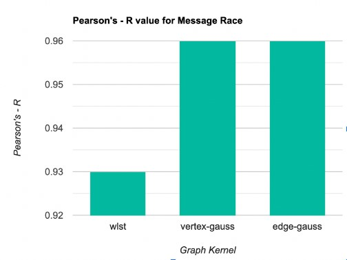
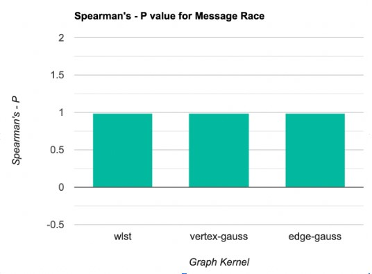
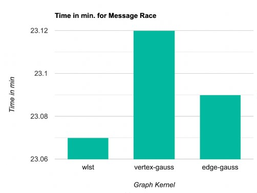

# Repositorio de Trabajo Final

Este repositorio contiene el trabajo final del proyecto realizado como parte del curso de Computaci\'on Paralela. El proyecto se centra en mejorar el framework de análisis de no-determinismo en aplicaciones MPI llamado ANACIN-X.

## Estructura del Repositorio

El repositorio está organizado de la siguiente manera:

- **ANACIN-X**: archivo principal del trabajo final en formato LaTeX. Contiene el framework de ANACIN-X con las modificaciones
- **Results**: Contiene resultados sobre algunas ejecuciones de los benchmark

## Descripción del Proyecto

El proyecto tiene como objetivo mejorar el framework ANACIN-X, que se utiliza para analizar el no-determinismo en aplicaciones MPI. El trabajo se basa en el artículo de Chapp et al. \[1\], que propone el uso de funciones kernel para calcular la similitud entre los grafos de ejecuciones de las aplicaciones MPI.

En particular, se propone cambiar las funciones kernel existentes (Histograma de nodos, histograma de vértices y función Weisfeiler-Lehman) con una función Gaussiana. Se realizaron cambios en la implementación de los graph kernels, utilizando las bibliotecas Grakel y graphkernels para mejorar la eficiencia y precisión de los cálculos.

Se llevaron a cabo experimentos utilizando un benchmark existente y se compararon los resultados obtenidos con las diferentes opciones de graph kernels. Los resultados mostraron que los nuevos graph kernels mejoraron la precisión del framework sin aumentar significativamente el tiempo de ejecución.

## Resultados

Los resultados obtenidos durante la experimentación son los siguientes.

### Comparaci\'on de PEARSON’S R

### Comparaci\'on de SPEARMAN’S P

### Comparaci\'on de Tiempos

### Comparaci\'on de Graph Kernels

| GRAPH-KERNEL  | WLST   | VERTEX-GAUSS | EDGE-GAUSS |
| ------------- | ------ | ------------ | ---------- |
| TIME *        | 23.07  | 23.12        | 23.09      |
| PEARSON’S R   | 0.93   | 0.96         | 0.96       |
| SPEARMAN’S P  | 0.99   | 0.99         | 0.99       |

## Bibliografía

\[1\] Chapp et al., "Identifying Non-Determinism in MPI Applications Using ANACIN-X," *IEEE Transactions on Parallel and Distributed Systems*, vol. 32, no. 1, pp. 138-153, 2021.

## Elaborado por

- María Cruz Cáceres: maria.cruz@ucsp.edu.pe
- Alan Monroy Bernedo: alan.monroy@ucsp.edu.pe
